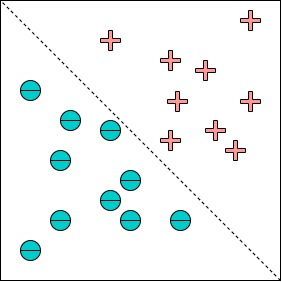

# Loan Eligibility Classification
Classification can be defined as the process of predicting a class or category from an observed value or a given data point. Categorized output can have a form such as “Black” or “White” or “spam” or “no spam”. Mathematically, classification is the task of approaching the mapping function (f) from the input variable (X) to the output variable (Y). It basically belongs to supervised machine learning where targets are also provided along with input data sets.
Below is an illustration of the classification. 

  

There are many algorithms / methods of classification that can be used, and in this experiment we use the decision tree method. Decision tree is one of the most popular classification methods because it is easily interpreted by humans. Decision tree is used for pattern recognition and is included in statistical pattern recognition.

The decision tree is built from 3 types of nodes, namely root nodes, intermediate nodes, and leaf nodes.
- leaf node contains a final decision/target in the decision tree
- The root node is the starting point of a decision tree
- Each intermediate node corresponds to a statement

The data we will use for classification is loan eligible dataset. The company wants to automate the loan eligibility process (real-time) based on the customer details provided when filling out the online application form. The details are Gender, Marital Status, Education, Number of Dependents, Income, Loan Amount, Credit History, and others. To automate this process, they provide a problem to identify the customer segments that qualify for the loan amount so that they can specifically target these customers. Here they have provided a partial data set. The dataset can be downloaded via https://www.kaggle.com/vikasukani/loan-eligible-dataset. In this dataset, there are 13 features including labels, namely
- Loan_ID Unique Loan ID
- Gender Male/Female
- Married Applicant married (Y/N)
- Dependents Number of dependents
- Education Applicant Education (Graduate/ Under Graduate)
- Self_Employed Self-employed (Y/N)
- ApplicantIncome Applicant income
- CoapplicantIncome Coapplicant income
- LoanAmount Loan amount in thousands
- Loan_Amount_Term Term of a loan in months
- Credit_History credit history meets guidelines
- Property_Area Urban/ Semi-Urban/ Rural
- Loan_Status Loan approved (Y/N)

Let's start, here are the steps that must be done for classification:
1. Import library used for all processes in classification
2. Load the loan eligible dataset
3. Preprocessing
4. Train Test split
5. Create a Decision tree model
